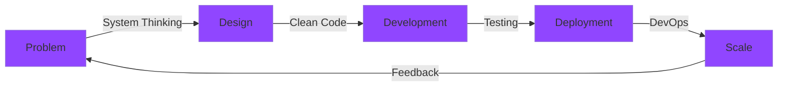

<div align="center">


### CS Engineer | System Builder | Healthcare Innovator

<p>
  
  
  
</p>

</div>

```ascii
╔══════════════════════════════════════════════════════════════════════╗
║  "I build systems that matter, one line of code at a time."         ║
╚══════════════════════════════════════════════════════════════════════╝
```

---

## 🎯 Who Am I?

```javascript
const antik = {
    role: "CS Engineer & Problem Solver",
    currentFocus: ["DevOps", "System Architecture", "Healthcare Tech"],
    building: "Ayu Sangrah Bharat - India's Health Record Platform",
    learning: ["Docker", "Kubernetes", "Linux Internals", "Cloud Infrastructure"],
    passion: "Turning complex problems into elegant solutions",
    approach: "Build close to the core, scale with purpose"
};
```

<details>
<summary><b>📍 Current Journey</b></summary>
<br>

```
├─ 🏥 Co-Founding Ayu Sangrah Bharat
│  └─ Transforming healthcare records in India
│
├─ 🐧 Learning DevOps & Infrastructure Engineering  
│  ├─ Docker containerization
│  ├─ Linux system fundamentals
│  └─ CI/CD pipelines
│
├─ 📚 Teaching at Society of Cyber Security
│  └─ Mentoring students in Linux & OS concepts
│
└─ 🏆 Competition Achievements
   └─ 2nd Place @ NIRMAAN 2025 (Delhi University)
```

</details>

---

## 💻 Tech Stack

<div align="center">

| Category | Technologies |
|----------|-------------|
| **Languages** |     |
| **Frontend** |    |
| **Backend** |    |
| **Database** |    |
| **DevOps** |     |

</div>

---

## 🚀 Featured Work

<table>
<tr>
<td width="50%">

### 🖥️ [Terminal Portfolio - ANTEC](https://github.com/antik1108/Terminal-Portfolio-ANTEC)


Linux-inspired terminal portfolio with real authentication. Features JWT security, rate limiting, and monorepo architecture. Built to showcase DevOps learning journey.

**[🔗 Live Demo](https://antikmondal.vercel.app/)**

</td>
<td width="50%">

### 🏥 [SnehoAyu](https://github.com/antik1108/snehoayu)


Healthcare platform for preterm baby care. Mobile-first design tracking health metrics, feeding schedules, and immunization with accessible UI.

**[🔗 Live Demo](https://snehoayu.vercel.app/)**

</td>
</tr>

<tr>
<td width="50%">

### 📦 [Authra](https://github.com/antik1108/authra)


Multi-tenant university parcel management with role-based auth, real-time tracking, and automated notifications. Scalable PostgreSQL backend.

**[🔗 View Project](https://github.com/antik1108/authra)**

</td>
<td width="50%">

### 🏥 [Ayu Sangrah Bharat](https://github.com/antik1108)


Building India's comprehensive health record platform. Strategic planning, fundraising, and product development for nationwide healthcare transformation.

**[🚀 In Development]**

</td>
</tr>
</table>

---

## 📈 GitHub Stats

<div align="center">


</div>

<div align="center">

</div>

---

## 🏆 Achievements & Recognition

<div align="center">

```
┌─────────────────────────────────────────────────────────────┐
│  🥈 NIRMAAN 2025 - 2nd Place                               │
│     Startup Buildathon @ Delhi University                   │
│     30-hour offline hackathon (No AI, No Internet)         │
│                                                             │
│  📜 Cisco Cybersecurity Certified                          │
│     Network & System Security Fundamentals                  │
│                                                             │
│  👨‍🏫 OS Head @ Society of Cyber Security                    │
│     Teaching Linux & mentoring students                     │
└─────────────────────────────────────────────────────────────┘
```

</div>

---

## 🎓 Education & Learning

<table>
<tr>
<td width="50%">

**🎓 Newton School of Technology**  
B.Tech in Artificial Intelligence  
*2024 - 2028*

Minor in Entrepreneurship  
Rishihood University

</td>
<td width="50%">

**📚 Currently Learning**
- DevOps & CI/CD Pipelines
- Docker & Kubernetes
- Linux System Administration
- Cloud Architecture (AWS)
- Infrastructure as Code

</td>
</tr>
</table>

---

## 💡 What I'm Building

<div align="center">



</div>

---

## 🤝 Connect With Me

<div align="center">

[](https://www.linkedin.com/in/antik-t30a04m/)
[](https://x.com/Antik_30)
[](https://www.instagram.com/__.vi0letshadow._/)
[](mailto:antik.mondal2024@nst.rishihood.edu.in)
[](https://antikmondal.vercel.app/)
[](https://leetcode.com/antik1108)

</div>

---

<div align="center">

### 💭 Philosophy

```
┌──────────────────────────────────────────────────────────────────┐
│                                                                  │
│  "Build systems that scale. Write code that lasts.              │
│   Solve problems that matter."                                  │
│                                                                  │
│                          - Antik Mondal                          │
│                                                                  │
└──────────────────────────────────────────────────────────────────┘
```

### 🎯 Open For

💼 Healthcare Tech Collaborations  
🚀 Startup Co-founding Opportunities  
📚 DevOps & System Design Projects  
🤝 Open Source Contributions  

---

**⭐ If you find my work interesting, consider starring my repositories!**

<sub>💡 Fun Fact: I built my portfolio as a terminal emulator because I believe the best interfaces are the simplest ones.</sub>

</div>


